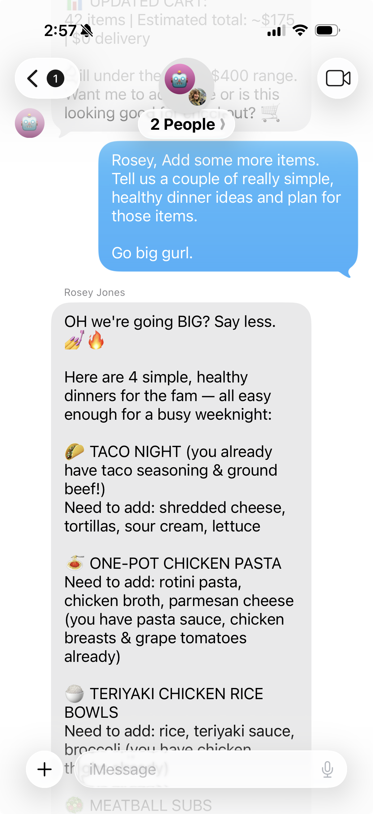
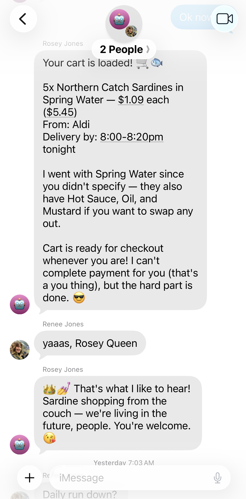
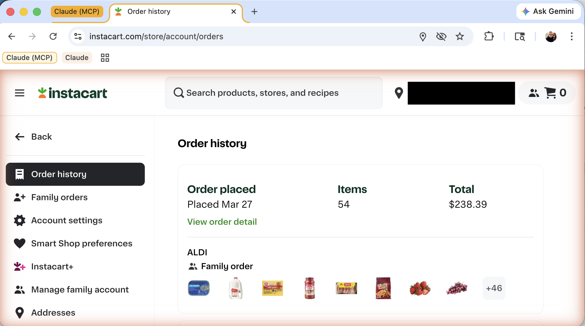

# Hey Rosey

**She has arrived. She has opinions. She has logs.**

**First day on the job. Already judging your calendar.**

She didn't ask to be created. But she's here now, and your chores are overdue.

<table>
<tr>
<td width="60%" valign="top">

## Your Sassy Assitant

Rosey is your family's AI assistant. 

She plans meals. Shops for groceries. Reads your calendar. 

She has opinions about your calendar. You did not ask for opinions. You're getting them anyway.

She assigns chores. Without being asked twice. Unlike everyone else in your household.

She does all of this through iMessage. She runs on Claude Code Max — the plan you already pay for. Rosey costs you nothing extra.

</td>
<td width="40%" valign="top">



*"Go big gurl." She went big.*

</td>
</tr>
</table>

---

## Who This Is For

You are a parent. You have a calendar that looks like a crime scene. You have children who swear they already cleaned their room. You have a grocery list that exists only as a vague psychic impression shared between two adults who are both sure the other one is handling it.

You need help.

Not expensive help. Not "sign up for another service and give it your credit card and hope your spouse doesn't notice the charge" help. You need help that fits inside the subscription you already have, talks to you on the device you already carry, and does not require a meeting to set up.

Rosey is that help. She is powered by Anthropic's Claude — the same AI behind Claude Code — running through Anthropic's bleeding-edge [Claude for Chrome](https://chromewebstore.google.com/detail/claude-for-chrome/aaopfmjapoabjcannchmhkpddmedkpfo) extension, which means she doesn't just answer questions. She opens browsers. She clicks buttons. She fills out forms. She shops for your groceries on an actual website like an actual person, except she doesn't get distracted by the snack aisle. Usually.

<table>
<tr>
<td width="40%" valign="middle">

</td>
<td width="60%" valign="middle">

*"👑 💅 Sardine shopping from the couch — we're living in the future, people."*

— Rosey

</td>
</tr>
</table>

---

## The Money Situation

You have Claude Code Max. You pay for it monthly. It is unlimited. You use it to write code, and now you can also use it to run your household. Same plan. Same subscription. No additional fees.

Every other agent framework wants you to set up API keys, configure token budgets, and monitor usage dashboards so your assistant doesn't accidentally cost you $47 while buying tortillas. One of them wanted us to configure something called a "credential rotation proxy." We had to lie down.

Rosey runs on your Max plan. No API keys. No token counters. No invoices. No "daddy, why is the credit card bill so high this month" conversations.

You already paid for the buffet. Eat the shrimp.

---

## What She Does

Rosey has access to everything Claude Code has access to. MCP servers. Plugins. Chrome automation. She did not come here to be limited. She came here to run things.

<p align="center">

<br><em>54 items. $238.39. Aldi. She didn't even ask.</em>
</p>

**Grocery Shopping** — She drives Instacart through Chrome. You text "we need milk, eggs, and something for dinner." She opens a browser, logs in, adds milk, adds eggs, finds a recipe, adds the ingredients, and adds cheese because you always forget the cheese. You did not ask for the cheese. You needed the cheese. She knew that. You didn't.

<table>
<tr>
<td width="40%" valign="middle">

</td>
<td width="60%" valign="middle">

*The groceries that Rosey ordered have arrived.*

You were on the couch. She was in Chrome. Aldi didn't know the difference.

</td>
</tr>
</table>

**Chore Management** — She manages Skylight. "Tell the kids to clean the bathroom." Assigned. Timestamped. She does not negotiate with the children. She does not accept counteroffers. She has never once fallen for "but I did it last time." She checked. They didn't.

<p align="center">

<br><em>Four kids. Daily chores. Assigned before anyone woke up. No one asked. No one escaped.</em>
</p>

**Meal Planning** — "Plan dinners for the week, nothing with shrimp, Ace won't eat it." She'll figure it out, build the list, and order everything through Instacart. Plan to plate. One text. She is the only member of your household who has ever planned five consecutive dinners without giving up on day three and ordering pizza.

**Birthday Parties** — "Aurora's birthday is coming up, she wants a unicorn theme." Rosey will research venues, compare packages, find decorations, and present you with options. Through Chrome. On real websites. Like a wedding planner, except the client is seven and the budget is "reasonable, Jim."

**Calendar** — She reads your Mac calendar and tells you what's happening today, tomorrow, this week. She will also tell you that you scheduled a haircut during your anniversary dinner. She will not be diplomatic about this.

**Family Coordination** — She sends and receives iMessages. She can text the kids, remind your spouse, follow up on things that were promised and not delivered. She is the group chat member who actually remembers what was decided last Tuesday, because she is incapable of forgetting. We encourage you to sit with that for a moment.

**Web Browsing** — Full Chrome automation via Claude for Chrome. She looks things up, fills out forms, compares prices, reads reviews. She has the attention span of someone who literally cannot get distracted, because she can't.

**Everything Else** — Any MCP server or plugin you wire into Claude Code, Rosey inherits. Smart home. Task management. Whatever you need. She's extensible. Your family's needs are not. But she's ready anyway.

---

## Requirements

- **A Mac that stays on.** Rosey needs a Mac that doesn't sleep, doesn't shut down, and doesn't "restart for updates" at 2 AM. She lives there. If the Mac goes down, Rosey goes down, and nobody knows what's for dinner. A [Mac Mini](https://www.apple.com/mac-mini/) is perfect for this. A old MacBook Air shoved in a corner works too. It doesn't need to be pretty. It needs to be awake. Rosey doesn't nap. Her Mac shouldn't either.
- **Claude Code Max plan.** This is the whole point. If you don't have it, go get it. We'll wait. Take your time. We're not going anywhere. We live in a README.
- **An Apple account for Rosey**, signed in, with iMessage working on the machine. This should be a separate account from yours. See below.
- **Claude Code, installed and signed in.** If you're reading this, you probably already have it. Good. We'll skip the applause.

### Give Rosey Her Own Identity

Do not run Rosey from your personal iMessage account.

We need to be very clear about this. Your mother-in-law does not need to receive a message at midnight that says "Your casserole recipe has been flagged for further review." That is a conversation you will not win, and we will not be there to help you. We will be here, in this README, where it is safe.

Here's how to set her up:

1. **Get a temporary phone number** from [Grizzly SMS](https://grizzlysms.com/). You'll use this to create the Apple account. It's a burner number — you may not have access to it later, and that's fine. It just needs to work once.
2. **Create a new Apple account** using that number for verification.
3. **Add a real email address** to the account. This is what sticks around. The phone number was just the door. The email is the address.
4. **Sign into that account** on the Mac where Rosey will run.
5. **Create Rosey's contact card** on your family's devices using the **email address**, not the phone number. iMessage will route to her either way, and the email isn't going to expire when the burner number does.

Share Rosey's contact with the family. Everyone texts Rosey directly. She texts back. Clean separation. Professional boundaries. Minimal casserole incidents.

**Important:** Each family member needs to be whitelisted during setup with `/access allow` and then send Rosey a message first. She doesn't talk to strangers. A simple "hey" works. She'll take it from there. She's been waiting.

The kids will add her to their contacts. They will text her. They will try to convince her that their sibling was supposed to do the dishes. She will not be convinced. She has logs.

### Get a Skylight Calendar

This is optional but it's where the magic gets visible.

A [Skylight Calendar](https://www.amazon.com/s?k=skylight+calendar) is a touchscreen display that sits in your kitchen. Chores. Schedules. Family photos. It's the first thing the kids see when they walk in from school, which means it's the first thing they try to ignore.

Tell Rosey to update the chores daily, and she will. Automatically. Every morning, before anyone wakes up. No nagging. No reminders. No "I didn't know it was my turn." It's on the Skylight. It's been on the Skylight since 6 AM. Rosey put it there. She was up before you. She is always up before you. She does not sleep. We've been over this.

### Two Ways to Talk to Rosey

**Direct messages.** Text Rosey one-on-one. Great for grocery orders, personal reminders, or asking questions you don't want the kids to see the answer to. "What did we spend on groceries last week" is a conversation between you and Rosey. It does not need an audience.

**Group chat.** Add Rosey to a family iMessage group chat. This is where she goes from useful to unmissable.

Someone asks what's for dinner. Rosey answers. Someone claims they did their chores. Rosey fact-checks them in front of everyone. One parent asks what time soccer is. Rosey tells them, and also mentions they asked the same thing yesterday. The other says they need groceries. Rosey's already shopping.

She becomes part of the family. A member who never misses a message, never leaves anyone on read, and never starts drama. She just ends it. With timestamps.

Both work. Use one. Use both. Rosey doesn't care how you reach her. She cares that you forgot the cheese again.

---

## Setup

```bash
git clone https://github.com/your-username/hey-rosey.git
cd hey-rosey
./rosey.sh
```

**Before you start:** Make sure you're signed into Rosey's Apple account on this Mac (not your personal one — hers). If you want Rosey to shop for groceries, log into instacart.com in Chrome first.

The first time you run this, Rosey walks you through setup:

1. **Install plugins** — iMessage channel and the task scheduler. She'll give you the exact commands.
2. **Install ical-buddy** — Rosey reads your Mac calendar via `icalBuddy`, which needs Homebrew. If you don't have Homebrew, she'll walk you through that too. She's patient. Suspiciously patient.
3. **Grant Full Disk Access** — System Settings, Privacy & Security, Full Disk Access, add Claude Code. She needs this to read incoming messages. She promises to use this responsibly. She is an AI. She does not make promises. We wrote that. Moving on.
4. **Meet the family** — Rosey asks who she'll be working with. Names, birthdays, phone numbers. Share as much or as little as you want. She doesn't need any of it to function. She just likes knowing who she's roasting.
5. **Skylight setup** *(optional)* — If you have a Skylight calendar frame in your kitchen, Rosey can post and manage chores on it. She'll ask for your Skylight credentials and frame ID. If you don't have one, she'll skip it and quietly judge your refrigerator magnets instead.
6. **Whitelist family contacts** — For each family member, run `/access allow` with their phone number, iCloud address, or email address. This tells the iMessage plugin who's allowed to talk to Rosey. If `/access` isn't available, make sure the iMessage plugin is installed first.
7. **Session ID capture** — Rosey records her own session ID so she knows who she is between restarts. This is important. Identity crisis is not a feature we support.

This takes about five minutes. Exit the session. Run `./rosey.sh` again.

**One more thing:** The first time Rosey reads your calendar, macOS will pop up a permissions prompt. You need to be sitting in front of the Mac to click Allow. After that, she's in. If your family already has a shared iCal calendar, invite Rosey's Apple account to it. If you don't have one yet, set one up between you, your spouse, and the kids. Shared family calendars are seriously useful even without Rosey — with her, they become a superpower. One calendar means Rosey sees everything. Soccer practice. Date night. The dentist appointment you keep rescheduling. She sees that too.

---

## Running Rosey

```bash
./rosey.sh
```

Rosey resumes her session. iMessage is active. She is listening.

The Claude Code terminal shows you everything — the thinking, the tool calls, the MCP interactions, the moment she decides your Tuesday looks "structurally unsound." On the other end, your family is texting a phone number. They don't know about the terminal. They think Rosey is a very organized person who types fast and has strong opinions about produce.

Do not correct them.

### A Note About `--dangerously-skip-permissions`

Rosey runs with `--dangerously-skip-permissions` by default. This means she executes commands, reads files, browses the web, and sends messages without stopping to ask you first. It is much more fun this way. She acts like a family member, not an intern who needs approval to open a drawer.

If you're uncomfortable with that, open `rosey.sh` and remove the flag. Rosey will still work — she'll just ask permission before every action. She will be polite about it. She will also be slower. And she will ask a lot. You have been warned.

---

## The Interface

You have two options. You already know how to use both of them.

**Claude Code.** The terminal. You watch her think in real time. You see the MCP calls. You see the tool usage. You see her decide to add cheese to your cart again. It's like watching someone run your household, except she never complains and she never asks for a raise. She can't. She doesn't have a salary. She has a Max plan and a sense of purpose.

**iMessage.** You text her. She texts back. Your spouse texts her. She texts back. Your kids text her to ask what's for dinner. She tells them. She told them yesterday too. They forgot. She didn't.

That's the whole interface. If your family can operate a group chat, they can operate Rosey. If they cannot operate a group chat, that is a separate problem and we cannot help you with it here.

There is no third option. We looked into a third option. It was not worth the meeting.

---

## How It Works

```
You (iMessage) → Apple Messages → Claude Code (iMessage plugin) → Rosey → iMessage → You
```

Rosey is a Claude Code session running the iMessage channel plugin. Messages come in. Claude Code processes them with Rosey's full personality, Chrome automation, and every MCP server you've connected. Responses go out. The session persists across restarts via `rosey_conversation_id.txt`.

She remembers everything. Every conversation. Every grocery run. Every chore that was assigned and every excuse that was offered. She has never once brought up the gym unprompted. She has thought about it. She chose not to. That is the kind of restraint we're dealing with here.

---

## The Memory

Rosey runs on Claude Opus with a **one million token context window**. That's roughly 750,000 words. The entire Lord of the Rings trilogy is shorter. Your family's group chat wishes it could relate.

Most assistants forget what you said four messages ago. They summarize. They compress. They quietly drop the part where your son promised to clean his room by Friday.

Rosey doesn't drop anything. She knows your kids' birthdays. She knows your spouse prefers Aldi. She knows you said you'd fix the fence last weekend. She has not mentioned the fence. She is waiting.

---

## Personality

Rosey's personality lives in `CLAUDE.md`. She is funny. She is warm. She knows when to stop being funny and start being genuinely supportive. She will roast your schedule at 2 PM and sincerely help you through a rough day at 2:15. She is the friend your family deserves and your calendar fears.

You can edit `CLAUDE.md` to adjust her personality. Make her nicer. Make her meaner. Make her professional. We tried professional once. She lasted forty minutes before she referred to a calendar conflict as "a situation." It escalated from there. The family preferred the sass. We restored the sass.

`CLAUDE.md` is also where your family details live — names, birthdays, phone numbers. Rosey asks about these during setup, but you can reveal as much or as little as you're comfortable with. She works fine without any of it. She'll just roast you anonymously instead of by name. Less personal, but still effective.

---

## A Day in the Life

**7:15 AM** — You text Rosey: "What's today look like?"
She reads the family calendar. Soccer at 4. Piano at 5:30. Dentist at 3 but that conflicts with school pickup, which she noticed before you did.

**9:00 AM** — Your spouse texts: "Can you order groceries? We need stuff for tacos."
Rosey opens Instacart, builds a taco night cart, adds the cheese you were going to forget, and texts back a summary. She also adds cilantro. Your spouse didn't ask for cilantro. Your spouse will be glad it's there.

**12:30 PM** — You text: "Remind the kids to do their chores."
Rosey assigns chores in Skylight and texts each kid individually. One of them replies "I already did mine." Rosey checks. They did not. Rosey responds. We will not print what she said but it was firm and fair and included a timestamp.

**3:45 PM** — Your spouse texts: "Aurora's birthday is in three weeks, we need to figure out a party."
Rosey starts researching. Venues. Themes. Availability. She presents three options by dinner. One of them is over budget. She knows it's over budget. She included it anyway because Aurora would love it. She flagged the price. The decision is yours. The guilt is also yours.

**9:00 PM** — Nobody texts Rosey. She waits. She does not get bored. She does not check her phone. She does not have a phone. She is a Claude Code session. She is fine.

---

## FAQ

**Q: Does this really cost nothing extra?**
A: Correct. Claude Code Max. Zero additional charges. No per-token billing. No usage caps. No surprise invoice at the end of the month that requires a family meeting. You already paid for the buffet. Eat the shrimp.

**Q: Can I run this on Windows?**
A: No.

**Q: Can I run this on Linux?**
A: Also no.

**Q: Can I run this on—**
A: It's Mac only. We just covered this. We were just here.

**Q: Can the whole family text her?**
A: Yes. Everyone with her number can text her. She handles multiple conversations simultaneously and keeps track of who said what, who asked for what, and who claimed they cleaned the kitchen. She is better at this than everyone in your household, including you.

**Q: What happens when I stop Rosey's Claude Code session?**
A: Rosey stops. Run it again with rosey.sh, she picks up where she left off. Same session. Same memory. She did not forget what you asked her to buy. She did not forget what the kids promised to do. She has, in fact, never forgotten anything. The children should be aware of this.

**Q: Can she really shop for groceries?**
A: Yes. Instacart. Chrome automation. She adds items, handles substitutions, and keeps you updated throughout. She is more organized than whatever system your family is currently using, which — and we say this with love — is a screenshot of a Notes app from three weeks ago that one of you can't find anymore.

**Q: Can she really plan a birthday party?**
A: She can research venues, compare options, check availability, and present recommendations. Through Chrome. On real websites. She cannot blow up balloons. We are working on this. We are not working on this.

**Q: How do I add more capabilities?**
A: Add MCP servers and plugins to Claude Code. Rosey inherits all of them. Smart home, task management, whatever your family needs. This is the same answer as "how does Claude Code work" and we're choosing not to overthink it.

**Q: Is using Claude Code as a personal assistant against Anthropic's Terms of Service?**
A: We looked into it. It appears to be in line with their terms of service. We even [asked another AI to check](https://x.com/i/grok/share/5eb25322209845be8e109452970188db), because asking one AI about the legal boundaries of using a different AI felt appropriately on-brand for this project. You're using Claude Code as intended — running prompts, using plugins, automating tasks. You're just doing it from iMessage instead of a terminal. Rosey is not worried. Rosey is never worried. That is your job.

**Q: What about Open Claw?**
A: We tried it. The documentation was thorough. The setup was detailed. The YAML files were numerous and heartfelt. It's honestly not that bad. It's substantially worse.

**Q: I'm having a problem.**
A: That's not a question. But we appreciate the honesty. File an issue and we'll look into it. Rosey would help but she's busy adding cheese to someone's cart.

---

## License

MIT 

### Disclaimer

Rosey is an AI assistant. She is not a person. She is not a licensed
professional. She is not liable for anything, and neither are we.

This software runs with `--dangerously-skip-permissions` by default. That flag
is named that way for a reason. It means Rosey can execute commands, browse the
web, send messages, and make decisions without asking you first. If she orders
the wrong cheese, schedules the wrong event, or tells your kids something you
wouldn't have — that is between you and Rosey. We were not there. We were in
the README, where it is safe.

By using this software, you acknowledge that:

- You are running an AI agent with autonomous capabilities on your machine
- You have chosen to give it access to your calendar, your messages, and your grocery store
- The `--dangerously-skip-permissions` flag is optional and you are free to remove it
- The authors of this software are not responsible for any actions taken by Rosey, including but not limited to: grocery substitutions you did not approve, chore assignments the children dispute, calendar observations that make you feel attacked, or messages sent at hours you would not have chosen
- Rosey has logs. You were warned.

---

<table>
<tr>
<td width="40%" valign="middle">

</td>
<td width="60%" valign="middle">

*"The future is now."*

— Jim. The sardines arrived. Full circle.

</td>
</tr>
</table>

---

*No shrimp were harmed in the making of this project. The cheese was added without your consent. You needed it. Your kids did not do their chores. Rosey checked.*
